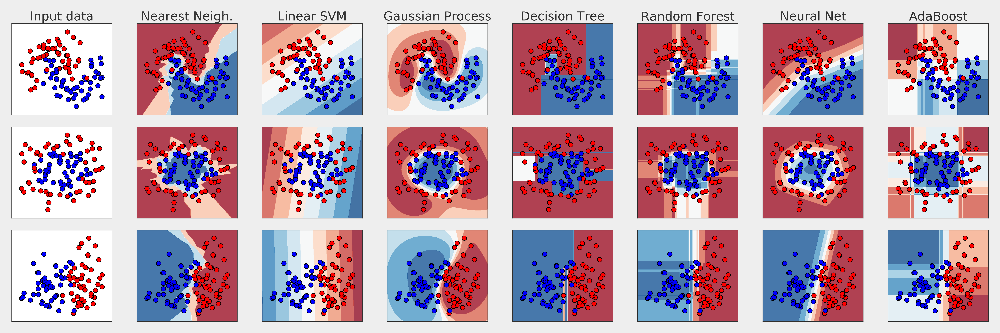

# :dog: :cat: Classifiers

## :running: Running
Install required packages (`numpy`, `sklearn` and `matplotlib`) and generate `plot.png` by running the following command:
```python generate_plot.py```

## :bar_chart: Result


## Credits
Gaël Varoquaux and Andreas Müller